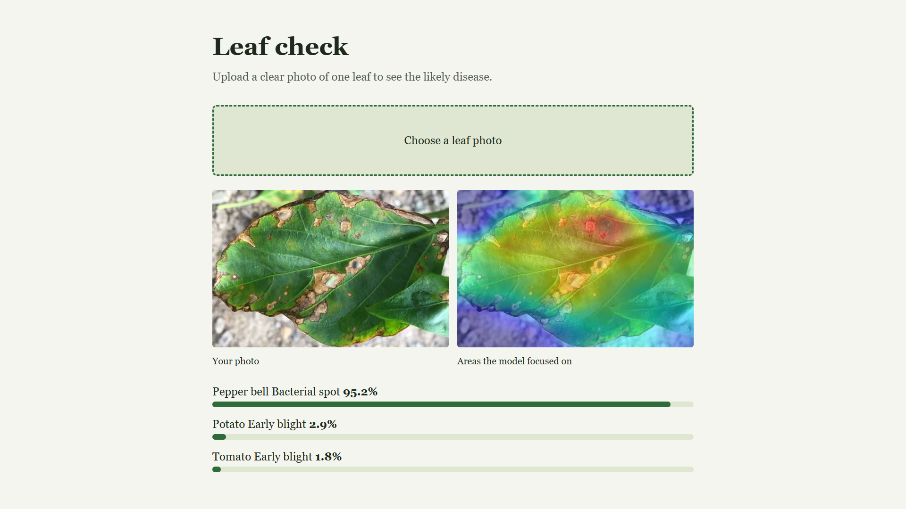

# Crop Disease Detector

Upload a photo of a pepper, potato or tomato leaf and get the top-3 likely diseases, a confidence score and a Grad-CAM heatmap showing which part of the image drove the prediction.

**Stack:** Python, PyTorch (EfficientNet-B0, transfer learning), OpenCV, FastAPI, Docker

> **Live demo:** _add link here after deployment_


<!-- Add screenshots: docs/screenshot.png (upload page with a result) and docs/gradcam_examples.png -->

## What this project is really about

A model trained only on the PlantVillage dataset scores about 99% on its own test set, but it falls to **22.8%** on real field photos. This project builds the full pipeline (training, API, explainability) and then measures and attacks that gap: adding real photos from PlantDoc and stronger augmentation raised accuracy on held-out real photos to **48.4%** in my training run. It is still not field-ready, and the limitations below say why.

## Results

| Model | Test data | Top-1 accuracy | Notes |
|---|---|---|---|
| v1: PlantVillage only | PlantVillage held-out test (3,095 images, 15 classes) | **~99%** | Macro F1 ≈ 1.00 |
| v1: PlantVillage only | PlantDoc real photos (1,095 images, 12 mapped classes) | **22.8%** (top-3: 50.5%) | Mean confidence 0.757, so it is overconfident |
| v2: PlantVillage + PlantDoc train split | PlantDoc held-out test (219 images, never trained on) | **48.4%** | v1 scored 22.8% on the same split; mean confidence 0.631 |

Notes on how to read these numbers:

- The v2 figure comes from a single training run (the script's own printout). With 219 test images the margin of error is roughly ±7 points. I could not re-verify the saved v2 checkpoint afterwards because my GPU quota ran out and a model-file mix-up occurred, so treat 48.4% as a single-run result.
- Per-class results on the 219-image split are noisy (11 to 30 images per class).
- On real photos, v1 collapsed most predictions into two classes (`Tomato_Early_blight` and `Tomato_Late_blight` received about 64% of all predictions), including many healthy leaves.

## How it works

1. **Data:** PlantVillage 15-class subset (pepper, potato, tomato; about 20.6k images) plus PlantDoc for real-world images.
2. **Model:** EfficientNet-B0 pretrained on ImageNet. v1 trains the classifier head first, then fine-tunes all layers.
3. **v2 changes:** half of every training epoch is drawn from real PlantDoc photos; stronger augmentation (random crops, rotation, colour jitter, blur, random erasing); label smoothing to reduce overconfidence; the best epoch is chosen on a PlantDoc validation split.
4. **Explainability:** Grad-CAM on the last convolutional block, overlaid on the photo with OpenCV.
5. **Serving:** FastAPI endpoint with file-type and size validation, a low-confidence warning, and a single-page upload UI.

## Project structure

```
crop-disease-detector/
├── src/
│   ├── train.py            # v1: transfer learning on PlantVillage
│   ├── train_v2.py         # v2: PlantVillage + PlantDoc, stronger augmentation
│   └── eval_realworld.py   # evaluation on the held-out PlantDoc test split
├── app/
│   ├── main.py             # FastAPI app + Grad-CAM
│   └── static/index.html   # upload UI
├── models/                 # model weights (not committed, see below)
├── Dockerfile
├── requirements.txt
└── README.md
```

## Quick start

```bash
pip install -r requirements.txt
```

**Train v1** (use a GPU, for example a free Colab T4). Data must be in `ImageFolder` layout, one folder per class:

```bash
python src/train.py --data /path/to/PlantVillage --epochs 8
```

**Train v2 and evaluate on real photos:**

```bash
pip install datasets matplotlib
python src/train_v2.py --pv /path/to/PlantVillage --init models/model.pt
python src/eval_realworld.py --model models/model_v2.pt
```

**Run the app.** It loads `models/model.pt` by default; change `MODEL_PATH` in `app/main.py` to use a different checkpoint.

```bash
uvicorn app.main:app --reload      # open http://localhost:8000
```

**Docker:**

```bash
docker build -t crop-detector .
docker run -p 8000:8000 crop-detector
```

### API

| Endpoint | Description |
|---|---|
| `POST /predict` | Multipart `file` (JPG/PNG, max 8 MB). Returns `predictions` (top-3 labels with confidence), `low_confidence` flag and a base64 `heatmap` image |
| `GET /health` | Health check |

### Model weights

Weights are not stored in this repository because of file size. Train them with the commands above, or download them from: _[Hugging Face](https://huggingface.co/QuantumToken/crop-disease-detector/tree/main)_.

## Limitations

- **Domain shift is the main weakness.** PlantVillage photos are single leaves on plain backgrounds; real photos are cluttered. Accuracy on real photos is far below the in-dataset score.
- **Only 15 classes** across three crops. Anything else (other crops, other diseases, pests, nutrient deficiency) will be forced into one of these classes.
- **Overconfident predictions.** Confidence scores are not calibrated, so a high score does not mean the prediction is right.
- **Noisy real-world labels.** PlantDoc images were scraped from the web and hand-labelled, and `Bell_pepper leaf spot` is only an approximate match for the pepper bacterial spot class. Near-duplicate images may exist across my train/test split.
- **Small real-world test set** (219 images), so results are indicative, not precise.
- **Not for real agronomic decisions.** This is a learning and portfolio project, not a diagnostic tool.

## Future work

- Collect and label my own field photos to grow the real-world training and test sets.
- Add leaf or lesion detection (YOLO) so cluttered photos are cropped before classification.
- Calibrate confidence and choose the "unsure" threshold from validation data.
- Add more crops and diseases, and treatment advice per disease.
- Add automated tests and CI, then deploy a public demo.

## Datasets and references

- **PlantVillage**: Hughes, D. P. & Salathé, M. (2015). *An open access repository of images on plant health to enable the development of mobile disease diagnostics.* 15-class pepper/potato/tomato subset obtained from [Kaggle](https://www.kaggle.com/datasets/arjuntejaswi/plant-village).
- **PlantDoc**: Singh, D. et al. (2020). *PlantDoc: A Dataset for Visual Plant Disease Detection.* ACM CoDS-COMAD 2020 (arXiv:1911.10317). CC BY 4.0. Used via the [`Project-AgML/plant_doc_classification`](https://huggingface.co/datasets/Project-AgML/plant_doc_classification) copy on Hugging Face.
## Author

_Prince Hadke_ · [GitHub](https://github.com/prince12568) · [LinkedIn](https://www.linkedin.com/in/prince-hadke-57465a31b/)
